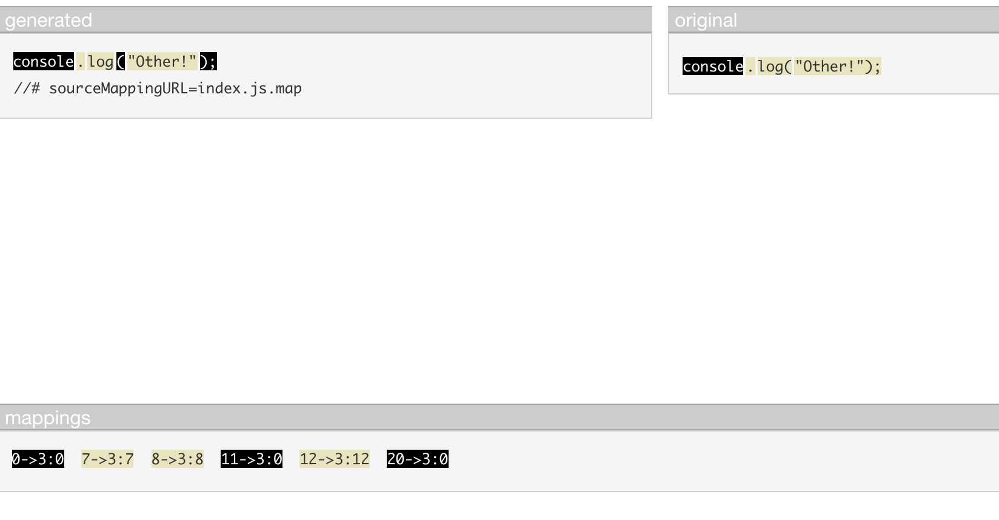

To get the same Parcel output as commited here, change the JSTransformer to 
```js
// @flow

import {Transformer} from '@parcel/plugin';
import {generate, parse} from '@parcel/babel-ast-utils';

export default (new Transformer({
  async transform({asset, options}) {
    let code = await asset.getCode();
    asset.setAST(
      await parse({
        asset,
        code,
        options,
      }),
    );
    return [asset];
  },

  generate({asset, ast, options}) {
    return generate({asset, ast, options});
  },
}): Transformer);

```

and change the default config:
```diff
--- packages/configs/default/index.json
+++ packages/configs/default/index.json
@@ -5,10 +5,7 @@
     "bundle-text:*": ["@parcel/transformer-inline-string", "..."],
     "data-url:*": ["@parcel/transformer-inline-string", "..."],
     "*.{js,mjs,jsm,jsx,es6,cjs,ts,tsx}": [
-      "@parcel/transformer-react-refresh-babel",
-      "@parcel/transformer-babel",
       "@parcel/transformer-js",
-      "@parcel/transformer-react-refresh-wrap"
     ],
     "*.{json,json5}": ["@parcel/transformer-json"],
     "*.jsonld": ["@parcel/transformer-jsonld"],
```